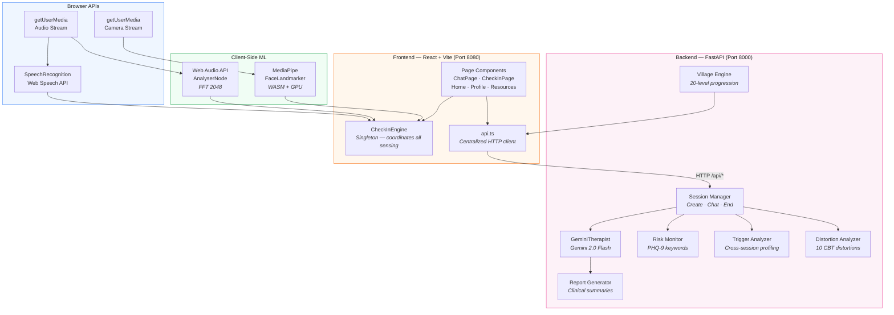
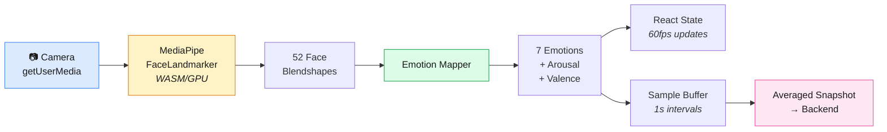
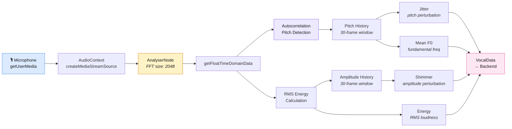
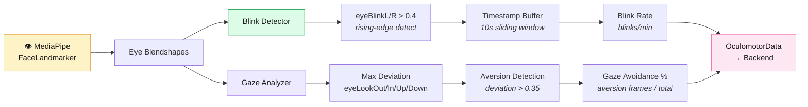
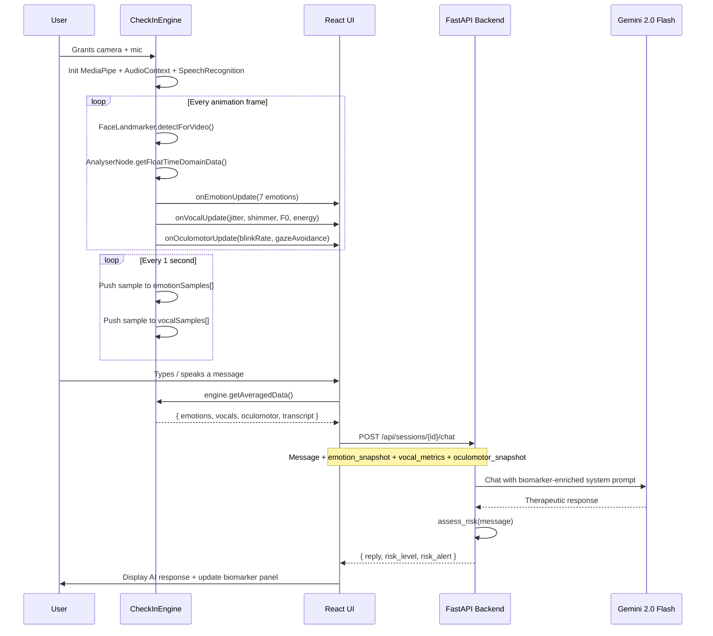

<div align="center">

# Within

**AI-Powered Multi-Modal Mental Wellness Platform**

Real-time biomarker sensing · Gemini 2.0 Flash therapeutic AI · Gamified recovery

[](https://react.dev)
[](https://fastapi.tiangolo.com)
[](https://ai.google.dev)
[](https://typescriptlang.org)
[](https://mediapipe.dev)
[](LICENSE)

*Built by **Team 404StressNotFound** — US-Nepal Hackathon 2026*

</div>

---

## Table of Contents

- [Overview](#overview)
- [System Architecture](#system-architecture)
- [Multi-Modal Sensing Pipelines](#multi-modal-sensing-pipelines)
- [Features](#features)
- [Tech Stack](#tech-stack)
- [Getting Started](#getting-started)
- [API Reference](#api-reference)
- [Project Structure](#project-structure)
- [Contributing](#contributing)
- [License](#license)

---

## Overview

Within is a full-stack mental wellness platform that moves beyond self-reported text to capture **physiological and behavioral signals** in real time. A singleton `CheckInEngine` orchestrates three concurrent sensing pipelines — facial emotion detection, vocal stress analysis, and oculomotor tracking — and streams the resulting biomarker context to a Gemini 2.0 Flash backend that drives clinically grounded therapeutic conversations.

The platform is designed around three principles:

1. **Multi-modal objectivity** — Emotions are inferred from blendshape geometry, voice perturbation metrics (jitter/shimmer), and eye movement patterns, not just what the user types.
2. **Therapeutic grounding** — The AI companion uses CBT-based cognitive distortion detection, PHQ-9 aligned risk scoring, and cross-session trigger profiling to steer conversations.
3. **Positive reinforcement** — A 20-level village gamification system rewards consistent engagement, making mental health maintenance feel rewarding.

---

## System Architecture



---

## Multi-Modal Sensing Pipelines

All three pipelines run concurrently inside the `CheckInEngine` singleton. Data is sampled every second, accumulated over the session, averaged, and sent to the backend with each chat turn.

### Facial Emotion Detection



**Blendshape → Emotion mapping:**

| Emotion | Primary Blendshapes | Weights |
|---------|-------------------|---------|
| Happy | `mouthSmileL/R` + `cheekSquintL/R` | 0.5 + 0.3 |
| Sad | `mouthFrownL/R` + `browInnerUp` | 0.5 + 0.4 |
| Angry | `browDownL/R` + `mouthPressL/R` | 0.5 + 0.3 |
| Fearful | `browInnerUp` + `eyeWideL/R` | 0.4 + 0.3 |
| Disgusted | `noseSneerL/R` + `mouthShrugUpper` | 0.5 + 0.3 |
| Surprised | `browOuterUpL/R` + `jawOpen` | 0.4 + 0.4 |
| Neutral | Computed as `max(0, 1 − Σ others)` | — |

**Derived dimensions:**
- **Valence** = `0.8·happy + 0.2·surprised − 0.6·sad − 0.4·angry − 0.3·fear − 0.5·disgust`
- **Arousal** = `0.8·angry + 0.7·fear + 0.6·surprised + 0.3·happy − 0.3·sad − 0.5·neutral`

---

### Vocal Stress Analysis



| Metric | Formula | Clinical Relevance |
|--------|---------|-------------------|
| **Jitter** | `mean(|Pᵢ − Pᵢ₋₁|) / mean(P)` | Pitch instability → vocal tremor under stress |
| **Shimmer** | `mean(|Aᵢ − Aᵢ₋₁|) / mean(A)` | Amplitude instability → emotional dysregulation |
| **Mean F0** | `mean(pitchHistory)` | Fundamental frequency — ↓ in depression, ↑ in anxiety |
| **Energy** | `√(Σxᵢ² / N)` | Voice loudness — engagement vs. withdrawal |

Pitch detection uses **autocorrelation**: the time-domain signal is correlated against lagged copies of itself. The lag at which the correlation peaks gives the fundamental period, converted to frequency via `F0 = sampleRate / lagAtPeak`. Voice activity gating requires RMS > 0.01 to avoid spurious pitch on silence.

---

### Oculomotor Tracking



| Metric | Threshold | Clinical Significance |
|--------|-----------|----------------------|
| **Blink Rate** | > 20/min | Elevated blink rate associated with anxiety and cognitive load |
| **Gaze Avoidance** | > 35% | Sustained gaze aversion linked to social anxiety, shame, and avoidance behaviors |

Both metrics are derived from the same MediaPipe FaceLandmarker output as the emotion pipeline — no additional model or sensor required.

---

### End-to-End Data Flow



---

## Features

| Feature | Description |
|---------|-------------|
| **Buddy AI Companion** | Gemini 2.0 Flash-powered therapeutic dog companion that receives real-time biomarker context with every message |
| **Live Biomarker Dashboard** | Expandable panel showing real-time FFT voice waveform, 7-emotion bar chart, circular eye-tracking gauges, and valence-arousal scatter plot |
| **Journal Check-In** | Three input modes (Video / Audio / Text) with full multi-modal capture and AI-powered analysis |
| **Cognitive Distortion Detection** | 10 CBT distortion types classified from conversation transcripts |
| **Trigger Profiling** | Cross-session accumulation of psychological triggers, themes, and growth areas |
| **Crisis Safety Net** | PHQ-9 keyword monitoring with automatic clinical escalation and emergency resources |
| **Village Gamification** | 20-level progression system — your virtual village grows with each completed session |
| **Clinician Portal** | Care team dashboard for viewing session reports and risk profiles |
| **Guided Breathing** | 4-7-8 box breathing exercises with visual animation and XP rewards |
| **Cultural Context** | Nepal-specific stressors: "Abroad ko Tension", "Ghar ko Pressure", "Remittance Burden" |

---

## Tech Stack

| Layer | Technology | Purpose |
|-------|-----------|---------|
| Frontend | React 18, TypeScript, Vite | SPA framework and build tooling |
| UI Components | Tailwind CSS, shadcn/ui, Radix | Design system and accessible primitives |
| Animation | Framer Motion | Page transitions and micro-interactions |
| Typography | Plus Jakarta Sans + Inter | Display headings + legible body text |
| Face Detection | MediaPipe FaceLandmarker | 52-blendshape face mesh at 60fps (WASM/GPU) |
| Audio Analysis | Web Audio API (AnalyserNode) | FFT-based pitch/energy extraction |
| Speech-to-Text | Web SpeechRecognition API | Browser-native live transcription |
| Visualization | Canvas 2D API | Real-time FFT waveform rendering |
| Backend | FastAPI, Pydantic, Uvicorn | Async Python API server |
| AI Model | Google Gemini 2.0 Flash | Therapeutic conversation and clinical analysis |
| Risk Engine | Custom keyword matcher | PHQ-9 aligned crisis detection |
| CBT Engine | LLM classifier | 10 cognitive distortion types |

---

## Getting Started

### Prerequisites

| Requirement | Version |
|------------|---------|
| Node.js | ≥ 18 |
| Python | ≥ 3.10 |
| Google API Key | [Gemini API access](https://aistudio.google.com/apikey) |

### Installation

```bash
# 1. Clone the repository
git clone https://github.com/Binit17/Within.git
cd 404StressNotFound

# 2. Install frontend dependencies
npm install

# 3. Set up the backend
cd backend
python3 -m venv venv
source venv/bin/activate        # Windows: venv\Scripts\activate
pip install -r requirements.txt

# 4. Configure environment
cp .env.example .env
# Add your key: GOOGLE_API_KEY=your_key_here
```

### Running

```bash
# Terminal 1 — Backend (port 8000)
cd backend && source venv/bin/activate
uvicorn main:app --port 8000 --reload

# Terminal 2 — Frontend (port 8080)
npm run dev
```

Open **http://localhost:8080** and grant camera/microphone permissions for full functionality.

> **Note:** The Vite dev server proxies `/api/*` requests to `localhost:8000` automatically.

---

## API Reference

Interactive documentation available at **http://localhost:8000/docs** (Swagger UI).

### Sessions

| Method | Endpoint | Description |
|--------|----------|-------------|
| `POST` | `/api/sessions` | Create a new therapy session |
| `GET` | `/api/sessions` | List all sessions |
| `GET` | `/api/sessions/{id}` | Get session details |
| `POST` | `/api/sessions/{id}/chat` | Send message with biomarker context |
| `POST` | `/api/sessions/{id}/end` | End session → trigger analysis + village growth |
| `GET` | `/api/sessions/{id}/report` | Generate clinical report |

### Biomarkers

| Method | Endpoint | Description |
|--------|----------|-------------|
| `POST` | `/api/sessions/{id}/emotions` | Submit facial emotion snapshot |
| `POST` | `/api/sessions/{id}/vocals` | Submit vocal biomarker data |
| `POST` | `/api/checkin/analyze` | Full multi-modal check-in analysis |

### Gamification & Profile

| Method | Endpoint | Description |
|--------|----------|-------------|
| `GET` | `/api/village/state` | Get current village level and progress |
| `POST` | `/api/village/grow` | Advance village (demo utility) |
| `POST` | `/api/village/reset` | Reset village to level 1 |
| `GET` | `/api/profile/triggers` | Get accumulated trigger profile |
| `GET` | `/api/health` | Service health check |

---

## Project Structure

```
within/
├── backend/
│   ├── main.py                 # FastAPI routes, session lifecycle, village engine
│   ├── gemini_client.py        # Gemini 2.0 Flash client with clinical system prompt
│   ├── models.py               # Pydantic schemas (Session, EmotionSnapshot, etc.)
│   ├── risk_monitor.py         # PHQ-9 keyword-based crisis detection
│   ├── trigger_analyzer.py     # LLM-driven cross-session trigger profiling
│   ├── distortion_analyzer.py  # 10-type CBT cognitive distortion classifier
│   ├── report_generator.py     # Clinical report generation via Gemini
│   ├── requirements.txt        # Python dependencies
│   └── .env.example            # Environment template
│
├── src/
│   ├── lib/
│   │   ├── checkInEngine.ts    # Multi-modal sensing engine (singleton)
│   │   └── api.ts              # Backend API client
│   │
│   ├── components/
│   │   └── LiveBiomarkerPanel.tsx  # Real-time visualization dashboard
│   │
│   ├── pages/
│   │   ├── Index.tsx           # Home — vitals, stress, garden, devices
│   │   ├── ChatPage.tsx        # Buddy AI chat with live biomarkers
│   │   ├── CheckInPage.tsx     # Multi-modal journal (Video/Audio/Text)
│   │   ├── BreathingPage.tsx   # Guided 4-7-8 breathing
│   │   ├── ResourcesPage.tsx   # Mental health resources library
│   │   ├── ClinicianPortal.tsx # Care team dashboard
│   │   ├── ProfilePage.tsx     # User profile and settings
│   │   └── SOSPage.tsx         # Emergency contacts and helplines
│   │
│   ├── hooks/
│   │   └── useGamification.tsx # Village progression and XP logic
│   │
│   └── index.css               # Design system, tokens, animations
│
├── vite.config.ts              # Vite config with /api proxy
├── tailwind.config.ts          # Tailwind extended theme
└── package.json
```

---

## Contributing

1. Fork the repository
2. Create a feature branch (`git checkout -b feature/your-feature`)
3. Commit changes (`git commit -m 'Add feature'`)
4. Push to the branch (`git push origin feature/your-feature`)
5. Open a Pull Request

---


## Team

**Team 404StressNotFound** — US-Nepal Hackathon 2026

| Member | Role | Contributions |
|--------|------|---------------|
| **Manushi Parajuli** | Team Lead, UI/UX Designer | Team coordination, project planning, UI/UX design system, component architecture, user flow optimization |
| **Sanskriti Poudel** | Product Strategist, UI/UX Designer | Concept ideation, feature specification, UI/UX design, gamification mechanics, breathing exercises module,  cultural contextualization |
| **Anjal Poudel** | Frontend Developer, Research | Frontend component development, resources page, mental health research & content curation |
| **Rebika Parajuli** | Frontend Developer, QA & Testing | Page development, responsive design implementation, cross-browser testing, user experience validation |
| **Binit KC** | Backend Engineer, Systems Integration | FastAPI backend architecture, Gemini AI integration, multi-modal sensing engine (MediaPipe + Web Audio + SpeechRecognition), real-time biomarker pipeline, frontend-backend integration,  |

---

## License

This project is open source under the [MIT License](LICENSE).

---

<div align="center">
<sub>Built with 🧠 + ❤️ for mental health by Team 404StressNotFound</sub>
</div>

